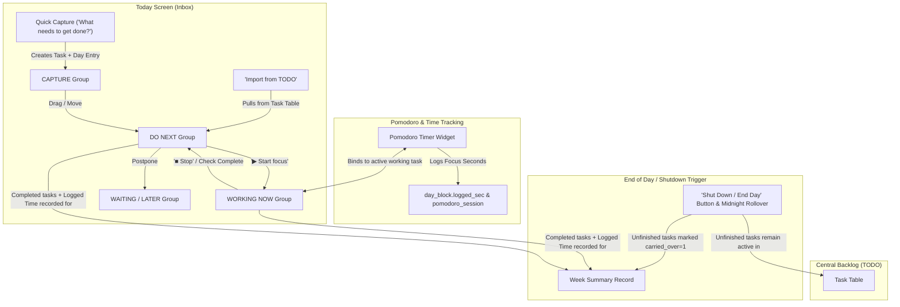

# Implementation Plan: Redesigning DeepDive to a "Get Things Done" (GTD) Action Flow

## Goal Description
Transition DeepDive away from rigid calendar time-blocking (allocating tasks into fixed start/duration minute slots on a daily timeline) toward a streamlined **"Get Things Done" (GTD) Action Workflow**, while preserving the app's strengths (Tauri v2 shell, SQLite persistence, Pomodoro timing, ambient audio, and offline desktop performance).

Based on user feedback:
1. **No historical record constraint**: As this is personal single-user software, we do not need backwards-compatibility wrappers for obsolete time-blocking structures. The new schema and architecture are designed cleanly for the GTD model.
2. **Explicit "Shut Down / End Day" button**: Added to the Inbox header/toolbar to allow one-click sweeping of unfinished tasks back to TODO and finalizing daily stats, alongside the automatic midnight rollover.
3. **Quick-Capture Option A**: Quick-adding an item immediately creates a central `task` and schedules it for Today's Inbox. If left unfinished at day shut down, it automatically remains in the central TODO backlog.

### Phased Roadmap (One by One)
- **Phase 1: Inbox Screen (`newScreen_Inbox.png`)** — **[CURRENT PHASE]** Redesign the daily workbench into a fluid GTD action list with minimal-click quick-capture, 4 execution groups (`WORKING NOW`, `DO NEXT`, `CAPTURE`, `WAITING / LATER`), live Pomodoro timer integration with task-level time logging, TODO import modal, and Shut Down workflow.
- **Phase 2: TODO Backlog (`newScreen_Todo.png`)** — Central task repository grouped by priority/deadline/project, with subtasks, quick-add targets (Today / Tomorrow / Inbox), and rich details rail.
- **Phase 3: Templates (`newScreen_Templates.png`)** — Reusable checklists and starter routines with a 1-click "Where to send tasks" destination (Inbox vs. TODO).
- **Phase 4: Week Summary & Carried-Over Tracking (`newScreen_week.png`)** — 7-day retrospective showing daily focus time accumulated, completed tasks vs. carried-over tasks, weekly focus stats, and category time allocation.

---

## Architecture & Data Flow



---

## Detailed Proposed Changes: Phase 1 (Inbox Screen)

### Database Layer (`src-tauri/migrations/` and `src/db/`)

#### [NEW] `src-tauri/migrations/0008_inbox_and_tags.sql`
- Add columns to support the GTD inbox grouping, task tags, energy levels, and carry-over state:
  ```sql
  -- Add GTD group, energy, tags, and time tracking to day_block
  ALTER TABLE day_block ADD COLUMN inbox_group TEXT NOT NULL DEFAULT 'capture';
  ALTER TABLE day_block ADD COLUMN energy TEXT;
  ALTER TABLE day_block ADD COLUMN tags TEXT NOT NULL DEFAULT '';
  ALTER TABLE day_block ADD COLUMN logged_sec INTEGER NOT NULL DEFAULT 0;
  ALTER TABLE day_block ADD COLUMN carried_over INTEGER NOT NULL DEFAULT 0;
  ALTER TABLE day_block ADD COLUMN imported_from_todo INTEGER NOT NULL DEFAULT 0;

  -- Add tags and energy to central task table
  ALTER TABLE task ADD COLUMN tags TEXT NOT NULL DEFAULT '';
  ALTER TABLE task ADD COLUMN energy TEXT;

  -- Index for rapid day-group queries
  CREATE INDEX idx_day_block_inbox_group ON day_block(day, inbox_group);
  ```

#### [MODIFY] `src-tauri/src/lib.rs`
- Register `0008_inbox_and_tags.sql` (version 8) in the Tauri SQL plugin migration list.

#### [MODIFY] `src/db/types.ts`
- Define `InboxGroup = 'working' | 'next' | 'capture' | 'waiting'`.
- Define `EnergyLevel = 'high' | 'medium' | 'low'`.
- Update `DayBlock` with `inboxGroup`, `energy`, `tags: string[]`, `loggedSec`, `carriedOver`, `importedFromTodo`.
- Update `Task` with `tags: string[]`, `energy: EnergyLevel | null`.

#### [MODIFY] `src/db/repos/blocks.ts`
- Update `rowToBlock` and `blockToParams` to serialize/deserialize new fields.
- Add repository functions:
  - `updateBlockInboxGroup(driver, id, group)`
  - `incrementBlockLoggedTime(driver, id, addedSec)`
  - `markUnfinishedAsCarriedOver(driver, day)`
  - `listBlocksForDayGroup(driver, day, group)`
  - `getInboxStats(driver, day)`: returns captured today, completed today, total logged focus seconds, and imported from TODO count.

---

### Stores Layer (`src/stores/`)

#### [MODIFY] `src/stores/blocks.ts`
- Add actions:
  - `setInboxGroup(day: string, id: number, group: InboxGroup): Promise<void>`
  - `startFocusOnBlock(day: string, id: number): Promise<void>`: moves any existing 'working' block to 'next', sets target block to 'working', and binds the Pomodoro timer to this task.
  - `stopFocusOnBlock(day: string, id: number): Promise<void>`: pauses/stops timer and updates block's `loggedSec`.
  - `addInboxTask(day: string, input: { title: string; energy?: EnergyLevel | null; estimateMin?: number; tags?: string[]; dueAt?: string | null; group?: InboxGroup }): Promise<number | null>`
    - Inserts `task` in `tasksRepo`.
    - Inserts `day_block` linked to `taskId` with specified group (default `'capture'`).
  - `importTasksFromTodo(day: string, taskIds: number[]): Promise<void>`: creates day blocks linked to `taskIds` in `next` group with `importedFromTodo = true`.
  - `rolloverUnfinishedToTodo(day: string): Promise<void>`: sets `carriedOver = 1` for all incomplete day blocks on that day and cleans up active pointers.
  - `moveBlockBetweenGroups(day: string, id: number, targetGroup: InboxGroup, targetIndex: number): Promise<void>`: handles drag-and-drop between groups.

#### [MODIFY] `src/stores/timer.ts`
- Synchronize timer ticks with the attached block's `loggedSec`: every active focus second increments the block's `loggedSec`.
- Provide smooth start/stop from the task row's `[▶ Start focus]` and `[■ Stop]` buttons.

#### [MODIFY] `src/stores/day.ts`
- Add `shutdownDay(day: string): Promise<void>`: triggers day shutdown, records shutdown time, and rolls unfinished tasks back to TODO with `carriedOver: true`.
- Automatically invoke `rolloverUnfinishedToTodo(yesterday)` during midnight tick.

---

### UI Components (`src/components/inbox/` & `src/components/views/`)

#### [NEW] `src/components/inbox/QuickTaskInput.tsx`
- Recreates the quick-add card from `newScreen_Inbox.png`:
  - Input field: "What needs to get done?"
  - Quick dropdown chips:
    - `⚡ Energy ⌵` (High / Medium / Low)
    - `⏱ Estimate ⌵` (15 min, 25 min, 30 min, 45 min, 60 min, 90 min)
    - `🏷 Project / Tag ⌵` (Deep Work, Admin, Research, Writing, etc.)
    - `📅 Due later ⌵` (Date preset or picker)
  - Helper text: "Press Enter to add" + `[Add]` green button.

#### [NEW] `src/components/inbox/InboxStatCards.tsx`
- 4-card metric strip:
  1. `8 tasks captured today` (tray icon)
  2. `2 completed today` (check icon)
  3. `0.8 h focus time logged` (clock icon)
  4. `3 imported from TODO` (arrow back / import icon)

#### [NEW] `src/components/inbox/InboxToolbar.tsx`
- Actions:
  - `[→ Import from TODO]` button (opens `ImportFromTodoModal`)
  - `[⏱ Show incomplete from yesterday]` button
  - `[🌙 Shut down day]` button (executes the explicit shutdown workflow requested)
  - Right controls: `[⑂ Filter ⌵]` and `[⇅ Sort: Added ⌵]`

#### [NEW] `src/components/inbox/InboxTaskGroup.tsx` & `src/components/inbox/InboxTaskRow.tsx`
- Group headers with task count badges:
  - `WORKING NOW (1)` (prominent card, active timer indicator, Pomodoro fraction, `[■ Stop]` button)
  - `DO NEXT (count)` (drag handle, checkbox, tags, estimate, logged time, `[▶ Start focus]`, `[⋮]`)
  - `CAPTURE (count)` (quick-added list)
  - `WAITING / LATER (count)` (deferred list with date badge)
- Drag-and-drop reordering within and between groups.

#### [NEW] `src/components/inbox/ImportFromTodoModal.tsx`
- Dialog to search and multi-select tasks from TODO backlog to import into `DO NEXT`.

#### [NEW] `src/components/inbox/IncompleteYesterdayModal.tsx`
- Dialog to review yesterday's unfinished items and import any with one click.

#### [NEW] `src/components/views/InboxView.tsx` (replaces `TodayView.tsx`)
- Container bringing together the header, quick input, stat cards, toolbar, task groups, and the bottom rollover notice.

#### [MODIFY] `src/components/chrome/Sidebar.tsx`
- Update the first navigation item from "Today" to "Inbox" with icon `<Tray size={14} />`.

#### [MODIFY] `src/components/chrome/RightRail.tsx`
- Keep Pomodoro widget, Current task card, Up next list, and Distraction log in sync with the active task in `WORKING NOW`.

---

### Styling (`src/styles/`)

#### [NEW] `src/styles/inbox.css`
- Dedicated styling for Inbox components matching the design tokens (`--bg-window`, `--border`, `--text`, `--font-serif`, etc.) and the visual design in `newScreen_Inbox.png`.
- Tag pill variants:
  - `.tag-deep-work`: Sage green
  - `.tag-admin`: Soft blue
  - `.tag-research` / `.tag-reading`: Muted violet
  - `.tag-communication`: Warm orange
  - `.tag-errand`: Coral pink
  - `.tag-planning`: Fresh green
  - `.tag-neutral`: Muted slate
- Strict validation via `node scripts/check-css-classes.mjs`.

---

## Verification Plan

### Automated Tests
1. **Migrations & Repositories**:
   - Verify `0008_inbox_and_tags.sql` applies without errors and indexes are intact (`src/db/migrations.test.ts`).
   - Repository unit tests for updating inbox groups, logging time, and carrying over unfinished items (`src/db/repos/blocks.test.ts`).
2. **Store Logic**:
   - `src/stores/blocks.test.ts`: Test `addInboxTask`, `startFocusOnBlock`, `stopFocusOnBlock`, `importTasksFromTodo`, and `rolloverUnfinishedToTodo`.
   - `src/lib/inbox.test.ts`: Pure unit tests for grouping, sorting, filtering, and stats calculations.
3. **Verification Commands**:
   ```bash
   pnpm test
   node scripts/check-css-classes.mjs
   pnpm typecheck
   ```

### Manual Verification
1. Quick-capture tasks with energy, estimate, and tag chips.
2. Click `[▶ Start focus]` -> verify task becomes `WORKING NOW` and Pomodoro timer runs with live focus tracking.
3. Import tasks from TODO backlog -> verify they appear in `DO NEXT` and stat count updates.
4. Check task completion -> verify strikethrough, stats increment, and completed styling.
5. Click `[Shut down day]` -> verify unfinished tasks are marked carried-over, return to TODO backlog, and stats lock.
